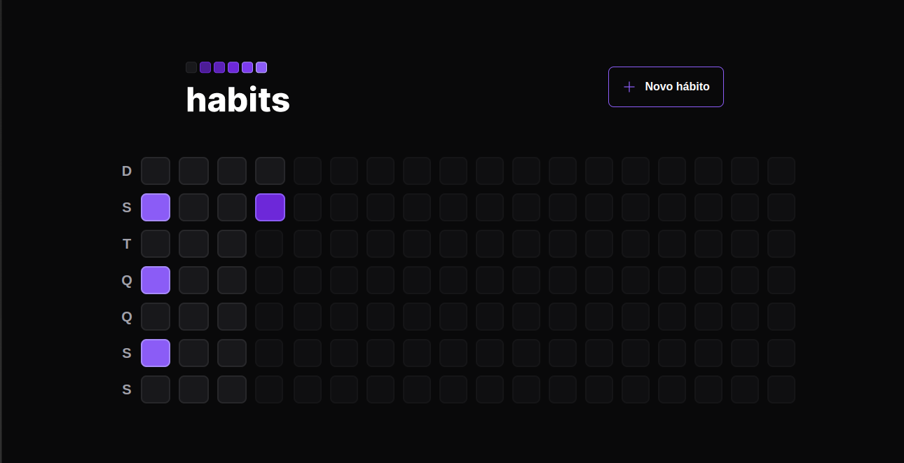

# habits

Aplicação de monitoramento de hábitos desenvolvida durante o evento NLW-SETUP.  

<strong>As tecnologias utilizadas foram:</strong>  
<strong>Front-end</strong> 
Web: React, TypeScript, Tailwindcss e Radix-ui. 
Mobile: React-Native, TypeScript, Tailwindcss e Expo;  
<strong>Back-end</strong> 
Server: Node, Fastify, TypeScript, Prisma e SQLite.  

<strong>Versão Mobile</strong> 

 
<strong>Vesrsão Web</strong> 

